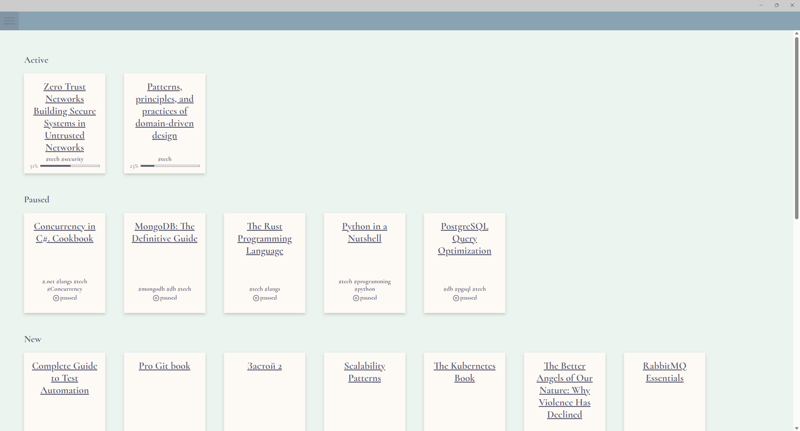
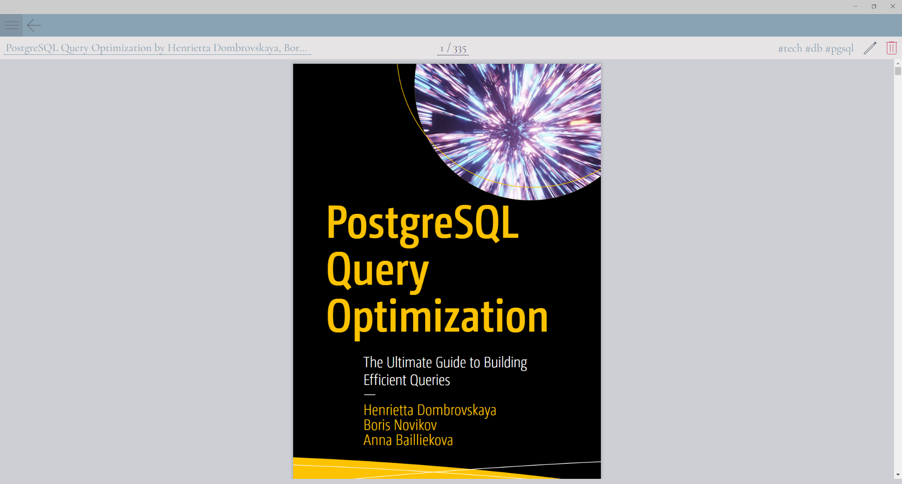

# BymseRead

Simple Windows desktop application for pdf books reading and management with built-in pdf viewer. It has bookmarks and last page tracking.

It was built using .NET MAUI with Blazor for the UI.

Books grid:

Book page:

# Local dev setup

1. Install https://ghostscript.com/releases/gsdnld.html

# Todo

1. Use cookies for auth
2. Change web client (allow header or cookies)
3. Connect with any oidc provider
4. Verify sessions refresh
5. Check if session validation is required for every api call
6. challenge only on request to authcontroller