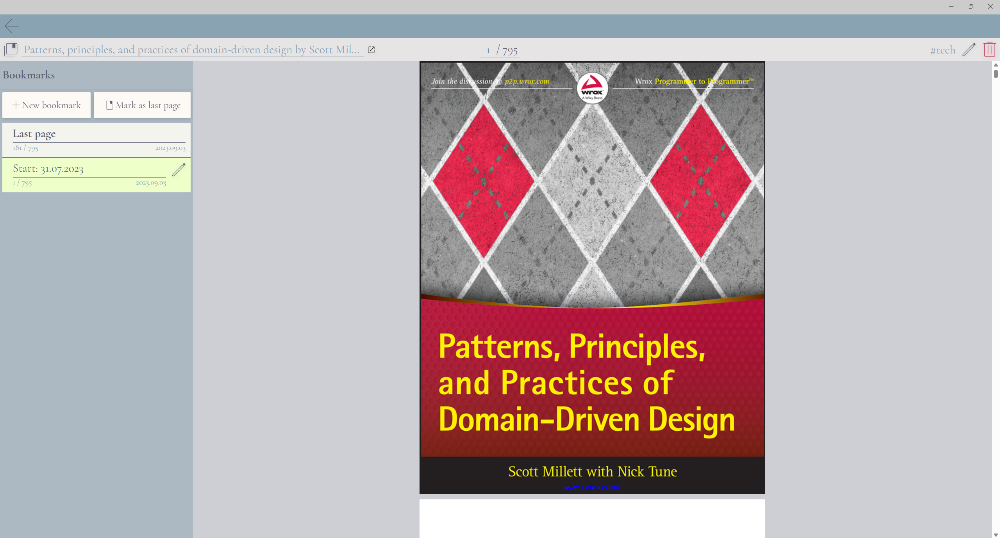

# BymseRead

Simple Windows desktop application for pdf books reading and management. It has built-in pdf viewer and last page tracking.  
In future there would be features like: bookmarks, search and more. 

It was built using .NET MAUI with Blazor for the UI.

Books grid:

Book page:
